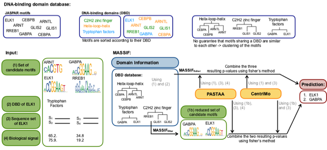

# MASSIF - motif association with domain information
MASSIF - motif association with domain information - is a tool to improve the performance of existing MEA tools. 
The main idea of our approach is to use the DNA-binding domain (DBD) of the TF to develop a domain information. 
Therefore we assume that a TF-motif association predicted by a existing MEA tool is more likely to be the correct one if the TF and the motif share a similar DNA-binding domain (DBD). 
For the considered TF the DBD is either known or can be predicted. 
However, we do not know the DBD for all motifs, especially for de-novo motifs. 
For that reason we can not simply discard TF-motif pairs with different DBDs.
Instead we construct a DBD database consisting of a set of known TF-motif pairs sorted according to their DBDs. 
Using the information provided by the database we are able to calculate the similarity between the predicted motif and the set of motifs that are linked to the DBD of the TF. 
We use this similarity, called domain information, in two different ways:
 - Using fisher's method to combine the domain information with the predictions of existing MEA tools.
- Applying the domain information as a filter to reduce the motif set before the MEA.

MASSIF uses as MEA tools [CentriMo](https://academic.oup.com/nar/article/40/17/e128/2411117) and [PASTAA](https://www.ncbi.nlm.nih.gov/pmc/articles/PMC2642637/). An overview is shown below:


# Installation

Necessarily installed software and packages:

- [The Meme Suite](http://meme-suite.org/doc/download.html) (version 5.0.2 or 5.0.3) to use CentriMo
- C++ compiler that is able to use openMP (and omp.h file which is part of the GNU OpenMP Library)
(Notice, for Mac OS the clang++ compiler and the packages libopm is necessary)

Download the repository. Notice, that the code for PASTAA is enclosed. 
To compile the C++ code of MASSIF and PASTAA perform the following commands: 
```
cd MASSIF/src
make
```
# Run test cases
To check if MASSIF is working correctly, we provide two test cases, a small example with only two sequence sets  and 11 motifs as well as a bigger one with 19 sequence sets and the corresponding 19 motifs.
To start the test cases run
``` 
cd ../
bash testSmall.sh path_to_meme_suite
bash testBig.sg path_to_meme_suite
```
where *path_to_meme_suite* is the path to the meme suite (something like /Home/.../meme-2.0.5/). The second test case may take some time. 

# Required input

**Using the domain information as prediction**

 To run the script where MASSIF apply the domain information as prediction the following input is required:
 
 - **motif_file** file that contains all consider motifs as TRANSFAC format (see [tests/transfac_testSmall.txt](tests/transfac_testSmall.txt) for an example).
 - **path_to_meme_suite** path to the meme directory  
 - **path_to_seq_dir** path to a directory that contains for each considered TF a fasta file (see [tests/seq_testSmall/](tests/seq_testSmall/)). Notice, that all sequences of a file must have the same length, otherwise CentriMo will only considere the shortest (or longest?. need to be checked) sequences and omit all the others.  Meaning  all sequences needs to be extended or shorten to a specific length. It is important that the original sequence is extended or shorten equally to both ends such that it is centered in the middle. Otherwise the assumption of CentriMo is not longer fulfilled. For more information see: 'Inferring direct DNA binding from ChIP-seq' by  Bailey et al.
 - **name** name for the output files
 - **path_to_biological_signal** path to a directory that contains for each TF a file with the biological signal (see [tests/biologicalSignal_testSmall/](tests/biologicalSignal_testSmall/)).  The file contains two tab-seperated columns. The first colum represents all headers (without >) of the corresponding FASTA-file sorted according to the intensity of their biological signal. The second colum just give the ranks. For instance the header of the sequence with the highest biological signal is listed first and the rank is 1. The biological signal itself is not necessary to provide in this file. For our examples shown in the paper we used as biological signal the signalValue provided by ENCODE. For more information see: 'PASTAA: identifying transcription factors associated with sets of co-regulated genes' by Roider et al.
 
 For instance, to run the small example the following command is required:
 ```
 python mainScript_DomainInfoPrediction.py  tests/transfac_testSmall.txt path_to_meme_suite/ tests/seq_testSmall/ testSmall tests/biologicalSignal_testSmall/
 ```
 where *path_to_meme_suite* is the path to the meme suite (something like /Home/.../meme-2.0.5/).
 
**Using the domain information as a filter**

The script that uses the domain information as a filer needs additionally:
- **thresholds_domainInfo** a file that gives for a specific pvalue threshold the corresponding domain information pro DNA-binding domain. The directory [RandomMotifs](RandomMotifs/) provides  several possible files for different pvalue thresholds. For the results shown in our paper, we used as a pvalue threshold 0.001 (meaning, we used the file [pvalue_0.001_ThresholdDomainInfo.txt](RandomMotifs/pvalue_0.001_ThresholdDomainInfo.txt))

To run the small example we need the following command:
 ```
  python mainScript_DomainInfoFilter.py  tests/transfac_testSmall.txt path_to_meme_suite/ tests/seq_testSmall/ testSmallFisher tests/biologicalSignal_testSmall/ RandomMotifs/pvalue_0.001_ThresholdDomainInfo.txt
 ```
 with *path_to_meme_suite* is the path to the meme suite (something like /Home/.../meme-2.0.5/).

# Output 
Both variations of MASSIF produce the following output: 

- **CentriMo_name** original result from CentriMo.
- **result_CentriMo_name.txt** parsed result from CentriMo.
- **PASTAA_name** original result from PASTAA.
- **result_PASTAA_name.txt** parsed result from PASTAA.
- **result_DomainInfo_name.txt** ranking of the domain information (the bigger the value the better).
- **result_fisherMethod_name.txt** final result. For each TF a ranking of motifs is given. The higher the ranking of the motif the more likely this motif corresponds to the TF. 

Using the domain information as prediction outputs additionally:

- **result_DomainInfoPvalues_name.txt** ranking  of the domain information interpreted as pvalue.

Applying the domain information as filter also provides as output:

- **significantMotifs_name.txt** file that contains for each TF the reduced motif set after the domain information is applied as filter.
- **setOfPWMs_name** directory that contains for each TF the motif_file for the reduced motif set.
