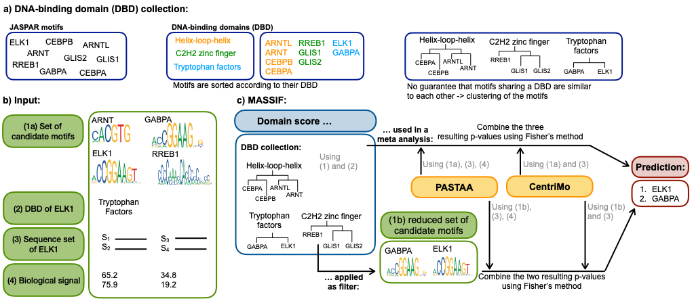

# MASSIF - motif association with domain information
MASSIF is a novel method to improve the performance of existing tool that link motifs to TFs relying on TF-associated sequences. MASSIF is based on the idea that a DNA-binding motif, which is correctly linked to a TF, should be assigned to a DNA-binding domain (DBD) similar to that of the mapped TF. Because DNA-binding motifs are in general not linked to DBDs, it is not possible to compare the DBD of a TF and the motif directly. Instead we created a DBD collection, which consist of TFs with a known DBD and an associated motif. This collection enables us to evaluate how likely it is that a linked motif and a TF of interest are associated to the same DBD. We named this similarity measure domain score, and represent it as a p-value.
We developed two different ways to improve the performance of existing tools that link motifs to TFs based on TF-associated sequences:
 (1) using meta analysis to combine p-values from one or several of these tools with the p-value of the domain score or
(2) filter unlikely motifs based on the domain score.  

MASSIF uses as tools [CentriMo](https://academic.oup.com/nar/article/40/17/e128/2411117) and [PASTAA](https://www.ncbi.nlm.nih.gov/pmc/articles/PMC2642637/). An overview is shown below:


More details on the method can be found in our [paper](https://doi.org/10.1093/bioinformatics/btz855).

# Installation

Necessarily installed software and packages:

- [The Meme Suite](http://meme-suite.org/doc/download.html) (version 5.0.2, 5.0.3 or 5.0.4) to use CentriMo. Add the tool to our PATH  environment variable. 
- C++ compiler that is able to use openMP (and omp.h file which is part of the GNU OpenMP Library)
(Notice, for Mac OS the clang++ compiler and the packages libopm is necessary. libopm can for instance be installed with 'brew install libomp')
- [mosta](http://mosta.molgen.mpg.de/) to calculate the similarity between Position Frequency Matrices.

Download the repository. Notice, that the code for PASTAA is enclosed. 
To compile the C++ code of MASSIF and PASTAA perform the following commands: 
```
cd MASSIF/src
make
```
# Run test cases
To check if MASSIF is working correctly, we provide two test cases, a small example with only two sequence sets  and 11 motifs as well as a bigger one with 19 sequence sets and the corresponding 19 motifs.
To start the test cases run
``` 
cd ../
bash testSmall.sh 
bash testBig.sh
```
The second test case may take some time. The final result using the domain score as a prediction are stored in 'result_fisherMethod_testX.sh' and for using the domain score as a filter the files are termed 'result_fisherMethod_testXFilter.sh', where X is either 'Small' or 'Big', depending on the test case. See [tests/test_results/](tests/test_results/) for the results we obtained. 

# Required input
**Using the domain score as prediction**

 To run the script where MASSIF apply the domain score as prediction the following input is required:
 
 - **motif_file** file that contains all consider motifs as TRANSFAC format (see [tests/transfac_testSmall.txt](tests/transfac_testSmall.txt) for an example).
 - **path_to_meme_suite** path to the meme directory  
 - **path_to_seq_dir** path to a directory that contains for each considered TF a fasta file (see [tests/seq_testSmall/](tests/seq_testSmall/)). Notice, that all sequences of a file must have the same length, otherwise CentriMo will only considere the shortest (or longest?. need to be checked) sequences and omit all the others.  Meaning  all sequences needs to be extended or shorten to a specific length. It is important that the original sequence is extended or shorten equally to both ends such that it is centered in the middle. Otherwise the assumption of CentriMo is not longer fulfilled. For more information see: 'Inferring direct DNA binding from ChIP-seq' by  Bailey et al.
 - **name** name for the output files
 - **path_to_biological_signal** path to a directory that contains for each TF a file with the biological signal (see [tests/biologicalSignal_testSmall/](tests/biologicalSignal_testSmall/)).  The file contains two tab-seperated columns. The first colum represents all headers (without >) of the corresponding FASTA-file sorted according to the intensity of their biological signal. The second colum just give the ranks. For instance the header of the sequence with the highest biological signal is listed first and the rank is 1. The biological signal itself is not necessary to provide in this file. For our examples shown in the paper we used as biological signal the signalValue provided by ENCODE. For more information see: 'PASTAA: identifying transcription factors associated with sets of co-regulated genes' by Roider et al.
 
 For instance, to run the small example the following command is required:
 ```
 python mainScript_DomainInfoPrediction.py  tests/transfac_testSmall.txt path_to_meme_suite/ tests/seq_testSmall/ testSmall tests/biologicalSignal_testSmall/
 ```
 where *path_to_meme_suite* is the path to the meme suite (something like /Home/.../meme-2.0.5/).
 
**Using the domain score as a filter**

The script that uses the domain information as a filer needs additionally:
- **thresholds_domainInfo** a file that gives for a specific pvalue threshold the corresponding domain information pro DNA-binding domain. The directory [RandomMotifs](RandomMotifs/) provides  several possible files for different pvalue thresholds. For the results shown in our paper, we used as a pvalue threshold 0.001 (meaning, we used the file [pvalue_0.001_ThresholdDomainInfo.txt](RandomMotifs/pvalue_0.001_ThresholdDomainInfo.txt))

To run the small example we need the following command:
 ```
  python mainScript_DomainInfoFilter.py  tests/transfac_testSmall.txt path_to_meme_suite/ tests/seq_testSmall/ testSmallFisher tests/biologicalSignal_testSmall/ RandomMotifs/pvalue_0.001_ThresholdDomainInfo.txt
 ```
 with *path_to_meme_suite* is the path to the meme suite (something like /Home/.../meme-2.0.5/).
 
**Using as input motif set the JASPAR motifs**

The similarities between the consensus motifs of the DNA-binding database and the motifs of the JASPAR database are precalculated. So, if you want to use the JASPAR motifs as motif input set you just need to enter the considered TF and the corresponding DBD in [clusterJASPAR/TF_to_DBD.txt](clusterJASPAR/TF_to_DBD.txt). Notice, that this entry needs to has the following format: TF\tDBD\t-1. TF should be the name of your fasta file (without .fa) and the DBD should be a  DBD listed in [clusterJASPAR/clusterJASPAR_info.txt](clusterJASPAR/clusterJASPAR_info.txt). This file contains all DBD that are part of the DNA_binding domain database.

 **Using as input motif set customized motifs**
 
 If you want to use customized motifs, for instance predicted by a *de novo* motif discovery algorithm or from another motif database, the similarities between the motifs within the input set and the consensus motifs of the DNA-binding database must be calculated before running MASSIF. Therefore the following commands are necessary:
``` 
#call mosta
cd ../clusterJASPAR
./path_to_mosta/sstat .41 list:matrix_list.txt balanced 1 >sstat.txt
#determines sumTFs.txt and DBDs.txt
python ../src/parse_result_sstat.py info_all_DBD.txt sstat.txt 
#determine TF_to_DBD.txt
python ../src/TF_DBDs.py info_all_DBD.txt  ENSG_HGNC.txt 
```

*path_to_mosta* needs to be replaced by the path to the mosta software. The file [clusterJASPAR/matrix_list.txt](matrix_list.txt) contains the paths to the consensus motifs, you need to add their the paths to your considered motifs. For an example how the format of the motifs should look like see [clusterJASPAR/DBD_1_cluster/](clusterJASPAR/DBD_1_cluster/cluster_*.mat). Notice that each motif must be stored in a seperate file in the directory [clusterJASPAR/PFMs/](clusterJASPAR/PFMs/) (needs to be created). For more details how to run mostas' similarity sstat have a look at their README. The commands listed above produce the output files sumTFs.txt, DBDs.txt and TF_to_DBD.txt, which are processed by MASSIF. 

# Output 
Both variations of MASSIF produce the following output: 

- **CentriMo_name** original result from CentriMo.
- **result_CentriMo_name.txt** parsed result from CentriMo.
- **PASTAA_name** original result from PASTAA.
- **result_PASTAA_name.txt** parsed result from PASTAA.
- **result_DomainInfo_name.txt** ranking of the domain information (the bigger the value the better).
- **result_fisherMethod_name.txt** final result. For each TF a ranking of motifs is given. The higher the ranking of the motif the more likely this motif corresponds to the TF. In addition the corresponding p-value is listed.

Using the domain score as prediction outputs additionally:

- **result_DomainInfoPvalues_name.txt** ranking  of the domain information interpreted as pvalue.

Applying the domain score as filter also provides as output:

- **significantMotifs_name.txt** file that contains for each TF the reduced motif set after the domain score is applied as filter.
- **setOfPWMs_name** directory that contains for each TF the motif_file for the reduced motif set.

# Citation
If you use MASSIF in your work please cite:

Improved linking of motifs to their TFs using domain information

N Baumgarten, F Schmidt and MH Schulz, Bioinformatics, btz855, 2019, https://doi.org/10.1093/bioinformatics/btz855
